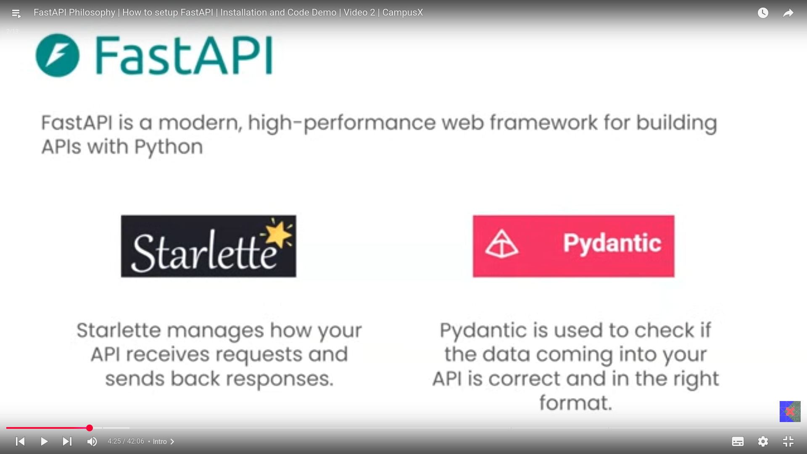
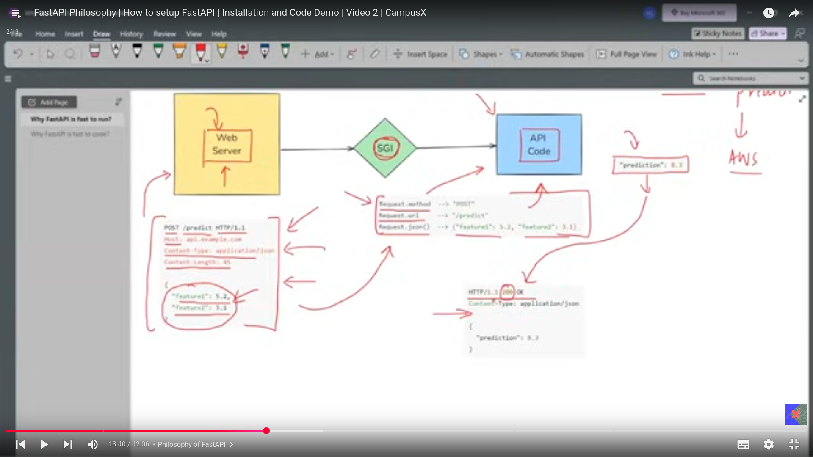
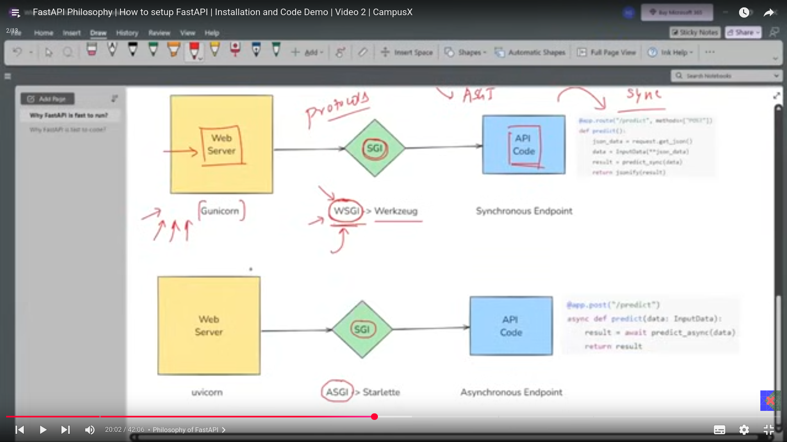
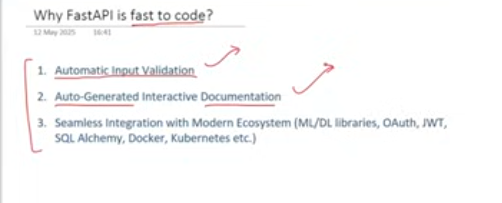

I am learning the FastAPi from the CampusX youtube channel and this is the first lecture.  

# API
- used to connect two software (eg the front end and the backend of a website) under some specific protocols(eg https) and set of rules.  
- before the invention of the API , there were the monolithic architecture(all the fornt end and the backend are at the same file where can interact with each other) where there were no APIs for the connectivity.  
- API returns the data in the json format which is a universal format which almost very language understand.  
- in today's time in almost every company they make a common backend and one database and there are lot of front ends like for the android for the iOS etc and they all are connected the backend using the APIs.  

# FastAPI
- python framework used to build the APIs.  
- its build on top of starlette and pydantic which are famous python libraries.  

starellte-- process the http request.  
pydantics-- data validation.  

## Advantages
FastAPI is fast to code and run and its due to following reasons.  

followiing is the comparison of the flask with the fastapi.the first flowchart is of the flask and the second one is of the fastapi.  

- in the fastapi all the components are asynchronous in nature means they can hanadle multiple requests at a time and thats why the fastapi is fast to run.  
also,

- when we want to fetch some data from server we do the get request and when we want to send some data to the server we do the post request.  
