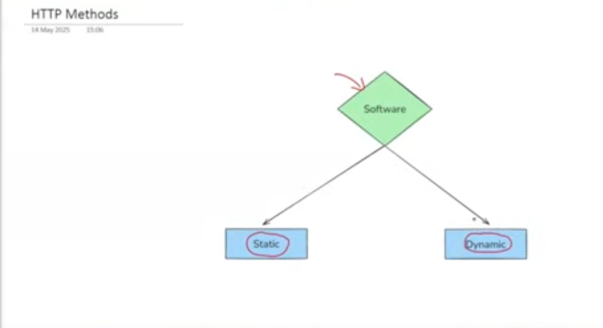

# HTTPS methods

following are the types of the sofware.  

- static are the one to which the user interaction is very low and we use them for the recieving of the information.(one way communication) eg the calender
- dynamic have the large user interactiona and they are used for both giving and recieving the information by the user.(two way communication)  eg the MS excel

 we will talk about the dynamic software.  
 we can interact with it in four ways i.e CRUD

## websites
- are deployed on some other device(known as the server) and the device by which we interact with it is the client and its the two way communication.and this communication is done using the protocol known as the http.  

what operation we are going to perform using the http method we have to use some verb with the http which are following:  
- the website can again be the static or the dynamic(having the crud operations).  
- for recieving/retrieving the information we use the get.  
- for giving the information we use the post.  
- for the update we use the put.  
- for delete we the delete.