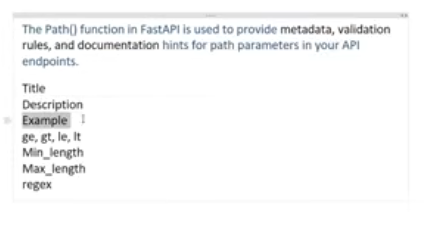
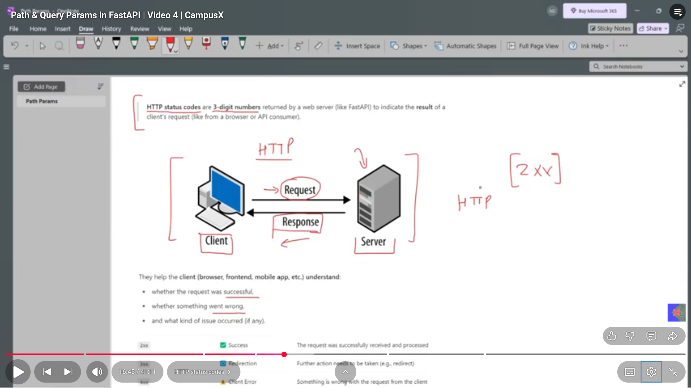
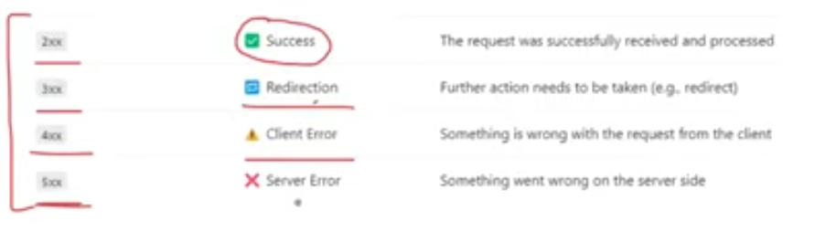
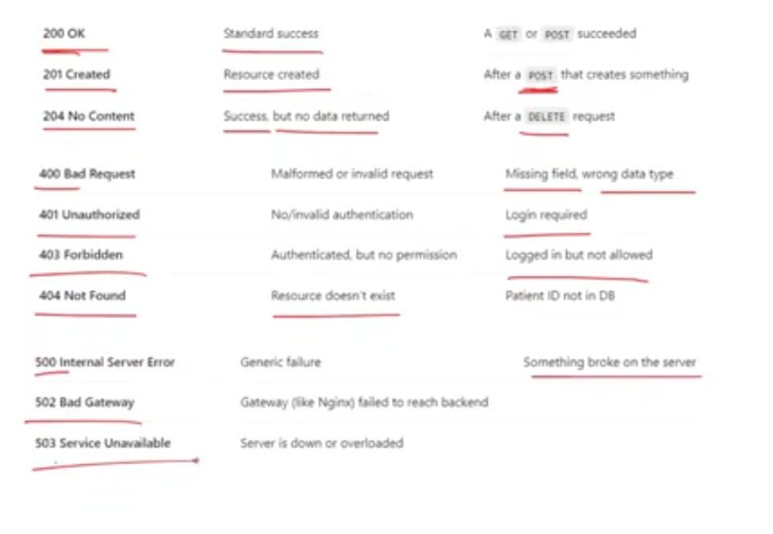
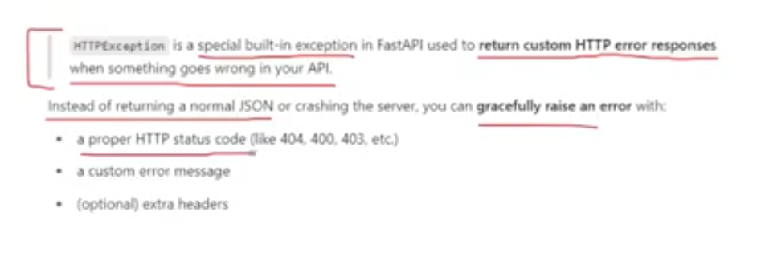
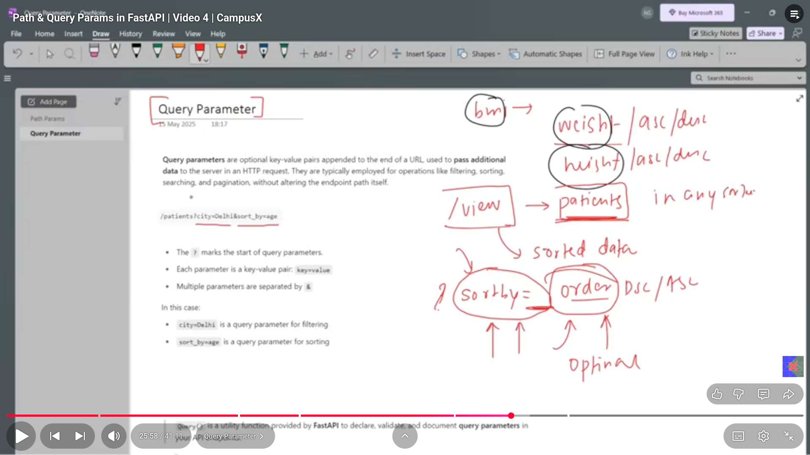
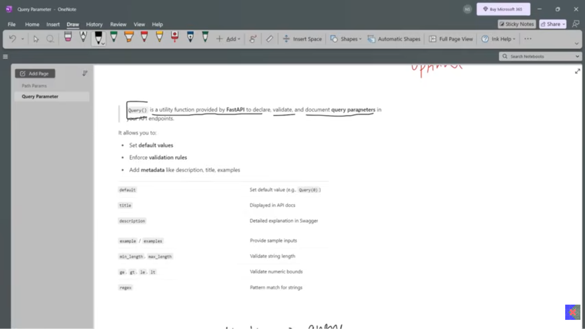

# path paramters
- dynamic segments of a URL path used to identify a specific resource.  
- used when out of the whole data we want to delete/retrieve or update some particular paramter.  

## path function
there is a built in path function in the fastapi which we can use as follow:  

## HTTP status codes
- three digit codes that gives us the status of the result of the client's request to a server.  

there are four types of the status code i.e the ones starting from two, three , four and then five. and they mean the following.  

following are some of the famous status codes.  

## HTTPexception

## Query paramter
- help us show the whole data in any sorted way of our choice

 the query parameter has also a function just like the one that was in the case of the path parameter.  

 

 