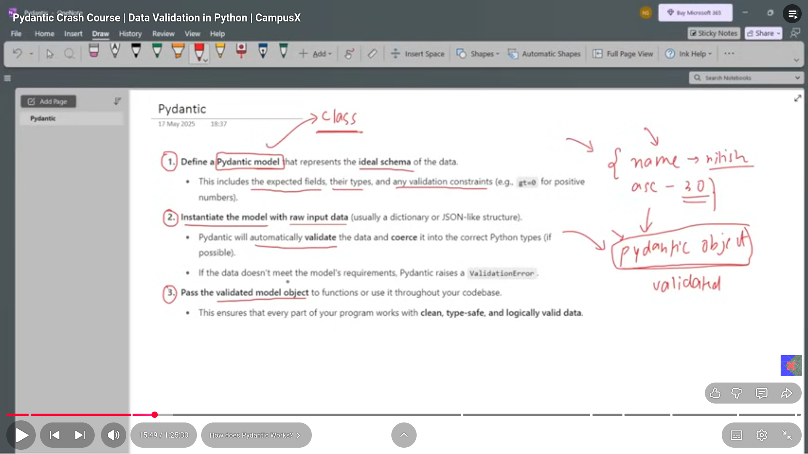

In the lecture 5 following topics are discussed

# Pydantic
- a library of the python used for the data validation.  
- as python is a dynamically typed language unlike java,c++ and here we can assign different datatypes values to one variable so there comes the issue of the data validation and pydantic solves this issue.  
- the issue with the python is the type validation as well as the data validation and its solved by the pydantic. 

## How does pydantic works
it works in the following three steps

- apart from the data validation,pydantic offers some other features also like sometimes converts the data types as per the need.like conversion of '30' into 30 if the need is of the 30 

### data validation
we can validate data using the pydantic as it also has some built in data types like for the validation of the email we has the Emailstr
- EmailStr --> for the validation of the emails
- AnyUrl --> for the validation of the URLs
- Field --> used for both the numerical as well as the str datatypes and is used for the data validation.
-----field is also used for adding the meta data.,,for this purpose import the annotated from the typing module and then use it along with the Field and hence can be used for the data validation.
---as the pydantic sometimes converts the '30' into 30 and if we don't want it then we have to do it using the field and we can do it by making the strict parameter of the field as true.
- field-validator--> to check like the email has the @gpgc.com or not instead of the @gmail.com

---------------------------------------------------------------
#extra point----
## decorator in python means---     
A decorator is a special function that modifies or adds extra behavior to another function without changing its code.eg
def my_decorator(func):
    def wrapper():
        print("Before the function runs")
        func()
        print("After the function runs")
    return wrapper

@my_decorator
def greet():
    print("Hello, Fawas!")

greet()

-------------------------------------------------------------