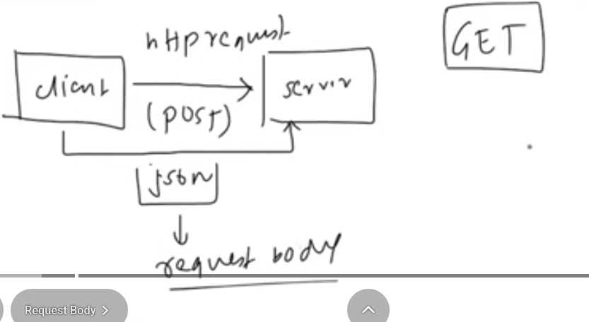

In this lecture I am studying the following topics

## request body:

## post http request
means when the client sends the information to the server

## get http request
means when the client wanrts to recieve some information from the client.

